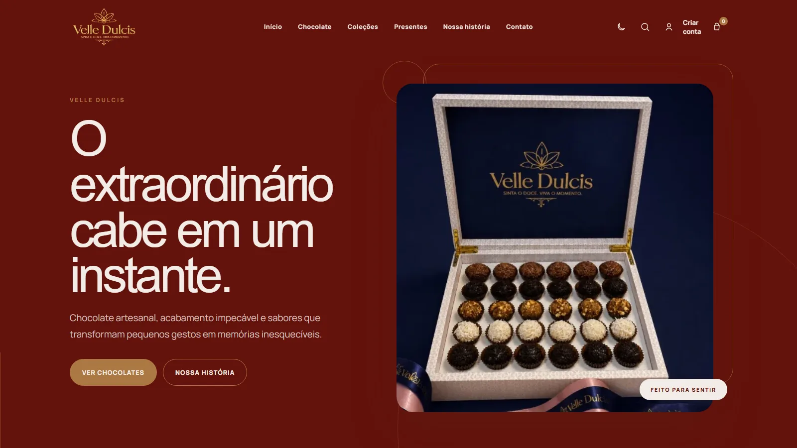
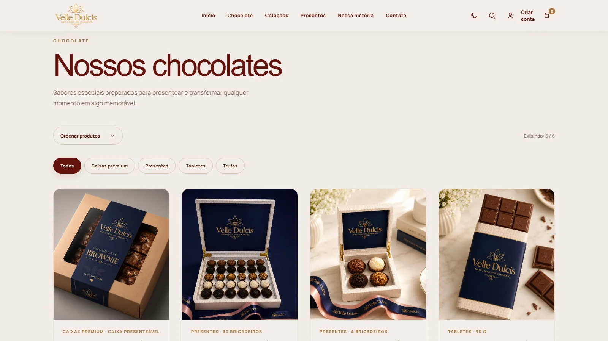
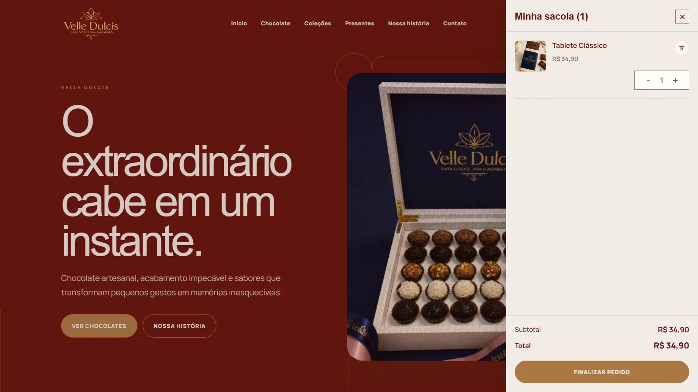
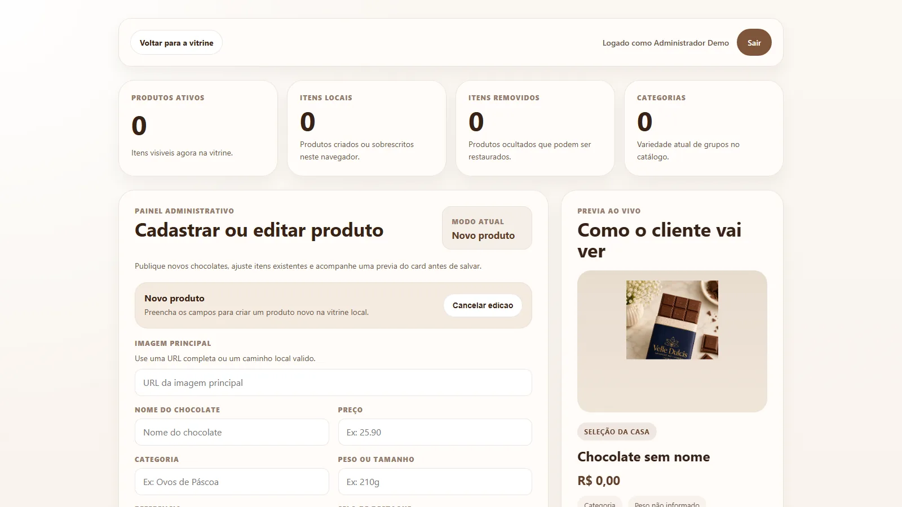
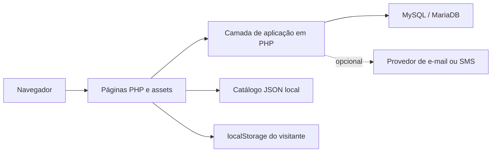

# Velle Dulcis

E-commerce acadêmico de chocolates com catálogo responsivo, autenticação, carrinho, pedidos e painel administrativo. O projeto combina uma experiência visual de marca com um backend em PHP e persistência em MySQL.

[Ver demonstração](https://imperio-do-choco.vercel.app) · [Repositório principal](https://github.com/alvez71/imperio-do-choco) · [Fork de Ícaro Matos](https://github.com/icarofdev/imperio-do-choco)

> A demonstração pública apresenta a interface e o catálogo estático. A hospedagem atual na Vercel não executa o backend PHP; login, persistência no MySQL e painel administrativo devem ser avaliados em ambiente local.

## Capturas reais

| Página inicial | Catálogo |
| --- | --- |
|  |  |

| Carrinho | Painel administrativo |
| --- | --- |
|  |  |

As imagens foram capturadas da aplicação em execução local, na proporção 16:9. O painel usa um administrador temporário criado apenas para a validação.

## Contexto e contribuição

Este é um projeto acadêmico desenvolvido em equipe. O repositório principal pertence a [alvez71](https://github.com/alvez71); este fork registra a participação de Ícaro Matos sem atribuir a ele o trabalho de todo o grupo.

No histórico disponível, commits atribuídos a Ícaro/SynxGM abrangem a reorganização e recuperação do frontend e do painel, além de ajustes de interface, tema, cadastro, carrinho, experiência mobile e integração com o banco de dados. Outros integrantes também contribuíram para a vitrine, a página de história, a recuperação de senha, imagens e ajustes de layout.

## Problema resolvido

A aplicação reúne a descoberta de produtos, a conta do cliente e a administração do catálogo em um único fluxo. Visitantes conseguem explorar os chocolates e manter uma sacola local; usuários autenticados podem persistir o carrinho, cadastrar endereço e gerar pedidos; administradores gerenciam os produtos exibidos pela vitrine.

## Funcionalidades implementadas

- página inicial responsiva, tema claro/escuro e navegação mobile;
- catálogo com busca, categorias, ordenação e página de detalhes;
- cadastro, login, logout e área da conta;
- recuperação de senha com token expirável;
- carrinho local para visitantes e sincronização com o banco para usuários autenticados;
- criação de pedidos, baixa de estoque e registro de movimentações;
- painel administrativo para criar, editar, remover e restaurar produtos;
- proteção CSRF nas operações de escrita e senhas armazenadas com `password_hash`;
- envio opcional de e-mail e SMS por provedores configurados no ambiente.

## Tecnologias

- PHP 8.2 e PDO;
- MySQL ou MariaDB;
- HTML5 e CSS3;
- JavaScript sem framework;
- JSON e `localStorage` como apoio ao catálogo e à experiência de visitante.

## Arquitetura e fluxo dos dados



O catálogo apresentado no navegador mescla três fontes: o JSON inicial versionado, produtos retornados pelo backend e alterações locais. Para visitantes, a sacola fica no `localStorage`. Após a autenticação, as rotas PHP sincronizam os itens com o MySQL; a finalização cria o pedido em uma transação, atualiza o estoque e limpa o carrinho.

### Decisão técnica

Manter um catálogo JSON como base permite demonstrar a interface quando o backend está indisponível. A aplicação tenta carregar os produtos do banco e preserva o fallback local, o que explica por que a vitrine funciona na demonstração estática enquanto as áreas autenticadas exigem PHP e MySQL.

## Instalação local

### Pré-requisitos

- PHP 8.2 ou superior com `pdo_mysql` e `mbstring`;
- MySQL 8 ou MariaDB compatível;
- extensão cURL do PHP apenas para integrações externas de e-mail/SMS;
- navegador moderno.

### Configuração

1. Clone o fork e entre na pasta:

```bash
git clone https://github.com/icarofdev/imperio-do-choco.git
cd imperio-do-choco
```

2. Crie um banco vazio chamado `imperio_do_choco` e um usuário local com acesso somente a esse banco.

3. Copie o modelo de ambiente:

```powershell
Copy-Item .env.example .env
```

4. Preencha `.env` com a porta e as credenciais do seu MySQL. O arquivo real é ignorado pelo Git.

5. Aplique as migrações:

```bash
php database/migrate.php
```

6. Inicie o servidor na raiz do projeto:

```bash
php -S 127.0.0.1:8080
```

7. Acesse `http://127.0.0.1:8080`.

Em uma instalação XAMPP no Windows, substitua `php` pelo caminho do executável, por exemplo `C:\xampp\php\php.exe`.

## Variáveis de ambiente

| Variável | Obrigatória | Finalidade |
| --- | --- | --- |
| `APP_ENV` | não | Identifica o ambiente, como `development`. |
| `APP_URL` | recomendada | URL-base da aplicação. |
| `DB_HOST`, `DB_PORT`, `DB_NAME` | sim | Endereço e banco da aplicação. |
| `DB_USER`, `DB_PASS` | sim | Credenciais locais do MySQL. |
| `EMAIL_PROVIDER` | não | `log` em desenvolvimento, `brevo` ou `smtp`. |
| `EMAIL_FROM`, `EMAIL_FROM_NAME` | para e-mail | Remetente das mensagens. |
| `BREVO_API_KEY` ou variáveis `SMTP_*` | conforme o provedor | Envio real de recuperação de senha. |
| `SMS_ENABLED` e variáveis `TWILIO_*` ou `SMS_API_*` | não | Notificação opcional de pedidos. |

Consulte [`.env.example`](.env.example) para a lista completa, sem credenciais reais.

## Migrações e administrador local

`database/migrate.php` controla cinco migrações idempotentes: usuários, produtos, carrinho, fluxo comercial e recuperação de senha. Executar o comando novamente apenas informa as versões já aplicadas.

Para criar um administrador, use o script exclusivo de linha de comando e variáveis temporárias. Nenhuma senha deve ser colocada no repositório:

```powershell
$env:ADMIN_NAME="Administrador local"
$env:ADMIN_EMAIL="seu-email@exemplo.com"
$env:ADMIN_PASSWORD="use-uma-senha-local-com-12-ou-mais-caracteres"
php scripts/criar-admin.php
Remove-Item Env:ADMIN_NAME, Env:ADMIN_EMAIL, Env:ADMIN_PASSWORD
```

O script cria ou atualiza a conta e salva apenas o hash da senha.

## Estrutura do projeto

```text
app/                 regras de negócio, segurança e acesso ao banco
assets/
  css/               estilos por página ou responsabilidade
  data/              catálogo inicial em JSON
  images/            imagens otimizadas da aplicação
  js/                catálogo, carrinho, tema e painel
database/            migrações e documentação do schema
docs/images/         capturas reais usadas neste README
public/              páginas e endpoints acessíveis pelo navegador
scripts/             tarefas seguras de manutenção via CLI
index.php             redirecionamento para a aplicação pública
```

## Exemplos de uso

Após iniciar o servidor, a consulta ao catálogo persistido pode ser testada com:

```bash
curl http://127.0.0.1:8080/public/buscar-chocolates.php
```

Em um banco recém-migrado e ainda sem produtos, a resposta real é:

```json
[]
```

Na interface, use **Criar conta** para testar autenticação, adicione um item à sacola e acesse o painel com uma conta administrativa criada pelo script CLI.

## Verificações

O teste pequeno e independente da proteção CSRF pode ser executado sem banco:

```bash
php tests/security_test.php
```

Para revisar sintaxe antes de enviar alterações, execute `php -l` nos arquivos PHP e `node --check` nos arquivos JavaScript. Os fluxos que dependem do banco devem ser validados após as migrações, com uma base exclusiva de desenvolvimento.

## Segurança e privacidade

- `.env` e arquivos de log estão ignorados;
- o repositório mantém apenas valores ilustrativos em `.env.example`;
- criação de administrador ocorre via CLI, sem SQL com credenciais prontas;
- sessões usam cookies com `HttpOnly`, `SameSite` e modo seguro quando há HTTPS;
- formulários e requisições de escrita validam token CSRF;
- senhas e tokens de recuperação são persistidos como hash.

## Dificuldade encontrada

O código precisa conciliar uma vitrine demonstrável sem servidor PHP com dados reais do MySQL quando o backend está disponível. Isso resultou em uma camada de mesclagem entre JSON, API e armazenamento local, além de dois modos de persistência do carrinho. Preservar o mesmo comportamento nos dois ambientes é o principal ponto de atenção ao evoluir o projeto.

## Limitações atuais

- a demonstração na Vercel não executa PHP nem MySQL;
- o banco inicia sem produtos; o catálogo JSON continua sendo a fonte visual de fallback;
- e-mail e SMS reais dependem de provedor e credenciais externas;
- não há integração com gateway de pagamento: o pedido é registrado com status `aguardando_pagamento`;
- os arquivos `assets/css/style.css` e `assets/js/script.js` ainda concentram responsabilidades legadas e exigem refatoração acompanhada de testes;
- ainda não existe uma suíte automatizada completa para os fluxos PHP e JavaScript.

## Próximas melhorias

- hospedar o backend em uma plataforma compatível com PHP e conectar um banco gerenciado;
- dividir os arquivos legados de estilo e carrinho em módulos menores;
- adicionar testes automatizados para autenticação, checkout, estoque e APIs administrativas;
- criar carga inicial versionada para produtos sem incluir dados sensíveis;
- documentar e automatizar um processo de deploy completo.

## Aprendizados técnicos

O projeto exercita integração entre frontend e backend sem framework, sessões e autorização por papel, migrações idempotentes, transações de pedido e estoque, fallback de dados para ambientes diferentes e configuração segura por variáveis de ambiente.
